<h1>Hi 👋, I'm Ayushi Jaiswal</h1>

<h3>Software Developer • Full-Stack Developer • Java & Spring Boot • AI Enthusiast</h3>

## 👩‍💻 About Me

I'm a **B.Tech CSE-DS student** passionate about building practical software and AI-powered applications.

- 💻 Interested in **Software & Full-Stack Development**
- ☕ Strong focus on **Java, DSA & Spring Boot**
- 🔧 Aspiring **Backend Developer**
- 🤖 Exploring **AI, ML & RAG-based applications**
- 🌐 Experienced with **React & Tailwind CSS**
- 🗄️ Working with **MySQL & PostgreSQL**
- 🧠 Solved **700+ problems** across coding platforms
- 🚀 Interested in solving **real-world problems through technology**

## 🎯 Current Focus

**Full-Stack Development**  
↓  
**Backend Development**  
↓  
**Java + Spring Boot**  
↓  
**AI / ML with Python**  
↓  
**RAG-based Applications**  
↓  
**AI-powered Real-World Solutions**

### 🔭 Currently Building

### 🌾 AI Rural Health Assistant

An AI-powered multilingual healthcare project focused on improving access to healthcare information and government health-scheme guidance for rural users.

**Focus:** AI • RAG • Healthcare • Accessibility

> 🚧 Currently in development

### 🌱 Currently Learning

- Spring Boot
- AI / Machine Learning with Python
- RAG (Retrieval-Augmented Generation)
- Backend Development
- Full-Stack Application Development

# 🛠️ Tech Stack

### 💻 Languages

### 🌐 Frontend

### ⚙️ Backend

### 🗄️ Databases

### 🧰 Tools

### 🤖 AI & Data

### 🎨 Design

# 🚀 Featured Projects

<table>
<tr>

<td width="50%">

<h3>🌾 AI Rural Health Assistant</h3>

<strong>🚧 In Progress</strong>

AI-powered multilingual healthcare assistant focused on rural healthcare access and government health-scheme guidance.

<strong>Focus:</strong> AI • RAG • Healthcare

🔒 Repository coming soon

</td>

<td width="50%">

<h3>✈️ Travel Saathi</h3>

Travel-focused web project developed during hackathon-related work.

</td>

</tr>

<tr>

<td width="50%">

<h3>🎓 Student Management System</h3>

Project focused on managing and organizing student-related information.

</td>

<td width="50%">

<h3>🎬 Netflix Clone</h3>

Frontend project inspired by the Netflix interface.

</td>

</tr>

<tr>

<td width="50%">

<h3>☁️ Salesforce Clone</h3>

Frontend project recreating the structure and interface style of Salesforce.

</td>

<td width="50%">

<h3>🏆 Reimagithon</h3>

Participated in Reimagithon with a focus on developing a practical technology solution.

<strong>Status:</strong> ✅ Completed

</td>

</tr>
</table>

# 🧠 DSA & Competitive Programming

### 700+ Problems Solved

> 🧩 700+ problems solved across LeetCode, CodeChef and Codeforces.

# 📊 GitHub Analytics

<h2 align="center">📊 GitHub Analytics</h2>

  
  

# 🔥 Contribution Streak

<h2 align="center">📈 Contribution Activity</h2>

  

# 🐍 Contribution Snake

  <picture>
    <source media="(prefers-color-scheme: dark)" srcset="https://raw.githubusercontent.com/Ayushi05105/Ayushi05105/output/github-contribution-grid-snake-dark.svg">
    <source media="(prefers-color-scheme: light)" srcset="https://raw.githubusercontent.com/Ayushi05105/Ayushi05105/output/github-contribution-grid-snake.svg">
    
  </picture>

# 🏆 Achievements

- 🏆 **Smart India Hackathon (SIH) — Top 50 Finalist**
- 💡 **Reimagithon — IIIT Delhi / IGDTUW**
- 🔧 **Technical Member — College Technical Club**

# 📜 Certifications

### Cisco Networking Academy

- **Data Analytics Essentials** — June 2026
- **Apply AI: Analyze Customer Reviews** — June 2026
- **Introduction to Modern AI** — June 2026

### Other

- **Summer Analytics 2025** — IIT Guwahati
- **Reimagithon of Innovertox 3.0** — Unstop

# 🤝 Open to Collaboration

I'm interested in collaborating on:

- 🤖 AI / ML projects
- 🔎 RAG-based applications
- 🌐 Full-Stack applications
- ☕ Java & Spring Boot projects
- 🚀 Real-world problem-solving projects
- 🏆 Hackathons

# 📫 Connect With Me

